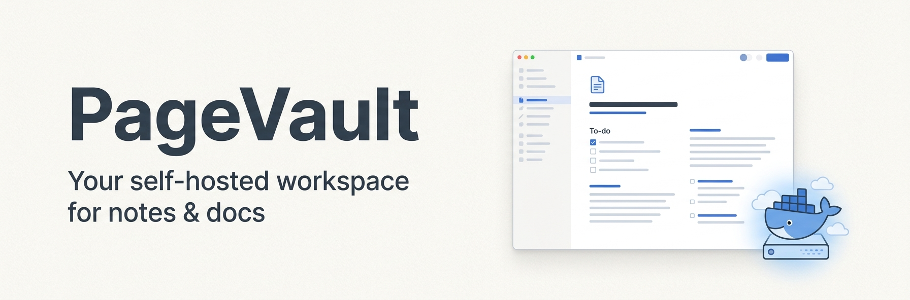

<p align="center">
  
</p>

<p align="center">
  
  
  
</p>

# PageVault

**Your self-hosted workspace for notes & docs.** A fast, Notion-style app — pages of blocks
organized in a nested sidebar — where **you own all the data**. The entire backend is a single
[PocketBase](https://pocketbase.io) container you bring up with one `docker compose` command. No cloud
account, no third-party service, no lock-in.

> Sign in, and everything you write lives in your own database on your own machine.

## Features

| Feature                                                              | Status |
| -------------------------------------------------------------------- | ------ |
| Email/password accounts (private, owner-scoped)                      | ✅     |
| Nested pages in a sidebar tree                                       | ✅     |
| Sub-pages + breadcrumb navigation                                    | ✅     |
| Archive to trash → restore or delete forever                         | ✅     |
| Favorite pages (pinned Favorites section)                            | ✅     |
| Duplicate a page (with all its blocks)                               | ✅     |
| Export a page as Markdown                                            | ✅     |
| Block editor — text, headings, lists, to-dos, quotes, code, dividers | ✅     |
| Markdown shortcuts (`# `, `- `, `1. `, `[] `, `> `, ` ``` `)         | ✅     |
| Slash command menu (`/` to pick a block type)                        | ✅     |
| Page icons                                                           | ✅     |
| Light / dark / system theme                                          | ✅     |
| Installable PWA                                                      | ✅     |
| Self-hosted via `docker compose`                                     | ✅     |
| Rich text (bold/italic) inside blocks                                | ⬜     |
| Drag-to-reorder blocks (optimistic)                                  | ✅     |
| Drag-to-reorder pages                                                | ⬜     |
| File & image uploads                                                 | ⬜     |
| Quick-find search (⌘K, titles + block content)                       | ✅     |
| Native iOS / Android builds (Capacitor)                              | ⬜     |

## Quick start (self-host in two commands)

**Prerequisites:** [Docker](https://docs.docker.com/get-docker/) (with Compose) and Node 22+.

```bash
# 1. Bring up the backend (PocketBase on http://localhost:8090)
docker compose up -d --build

# 2. Install deps and start the app
npm install
npm run dev            # http://localhost:5173
```

Create the first superuser + a seeded demo account:

```bash
# Create the PocketBase superuser (used by the Admin UI and the seed script)
docker compose exec pocketbase /pb/pocketbase superuser upsert admin@pagevault.local 'AdminPass123!'

# Seed a demo user (test@example.com / TestPassw0rd!) with starter pages
npm run seed
```

Open http://localhost:5173, sign in with `test@example.com` / `TestPassw0rd!` (or register your own),
and start writing. The PocketBase Admin UI lives at http://localhost:8090/_/.

### Install as a PWA

Open the app in a Chromium browser and use **Install app** from the address bar — PageVault runs in
its own window and is available offline-capable as a standalone workspace.

## How it works

PageVault is a **thin client over PocketBase**:

- **Client** — Ionic 8 + React 19 + TypeScript (strict), Vite, Capacitor. A desktop/PWA-first layout:
  a persistent sidebar (the page tree) beside a document editor. Server state flows through
  react-query wrapping the PocketBase JS SDK; there are no bare fetches in components.
- **Backend** — a single **PocketBase** binary (auth + SQLite + REST + realtime + file storage) run
  by `docker-compose.yml`. Its schema is **version-controlled JavaScript migrations** in
  `pb_migrations/`, auto-applied on boot, so a fresh `docker compose up` always has the right tables.

### Where the data lives

Everything is stored in **`./pb_data`** (a gitignored volume): the SQLite database and any uploads.
Back it up by copying that folder; move it to another host and your whole workspace comes with it.

- **`users`** — accounts (email/password).
- **`pages`** — a document: title, icon, a self-referential `parent` for the nested tree, and an
  `owner`.
- **`blocks`** — the ordered content of a page (text / heading / subheading / to-do / quote /
  divider).

### Privacy model

PageVault is **account-first and owner-scoped**. Every collection's access rules are
`owner = @request.auth.id` at the database level, so a user can only ever read or write their own
pages and blocks — enforced by PocketBase, not just the UI. There is no guest/anonymous surface.

## Development

```bash
npm run quality      # full gate: lint + format + line-length + feature-coverage + tests(80%) + CRAP + build
npm run test         # unit tests (Vitest)
npm run test:e2e     # Gherkin acceptance tests (Playwright + playwright-bdd)
npm run pb:logs      # tail the PocketBase container
npm run gen:icons    # regenerate app icons from assets/icon*.png
```

Quality is non-negotiable and enforced by a husky pre-commit hook + CI: no `any`, every logic file
≤ 100 lines, ≥ 80% coverage, CRAP ≤ 15 per function, Gherkin acceptance tests, and a clean build. See
[`CLAUDE.md`](./CLAUDE.md) for the full engineering charter.

## License

MIT
